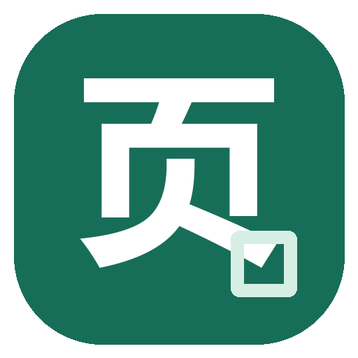
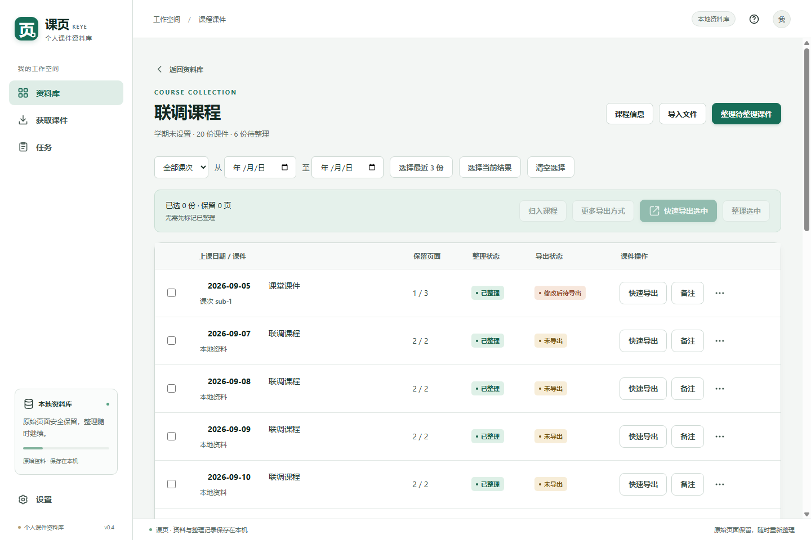
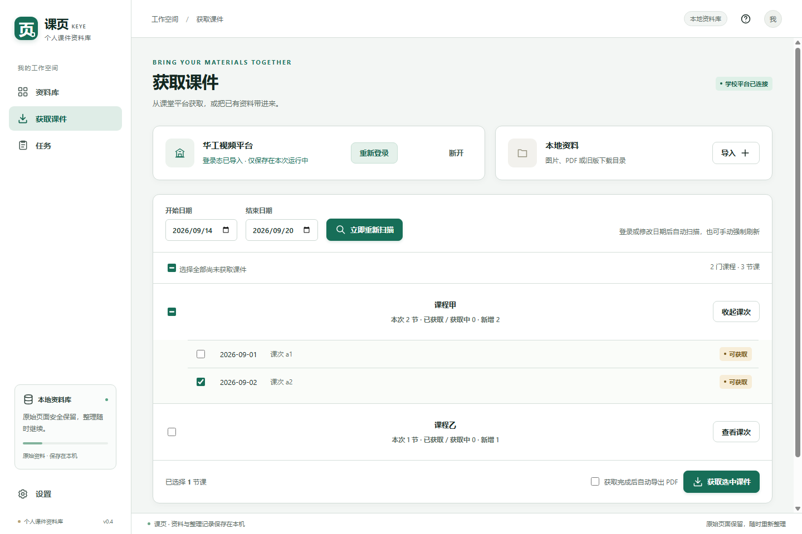
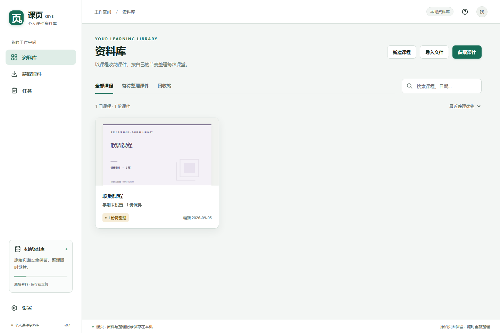
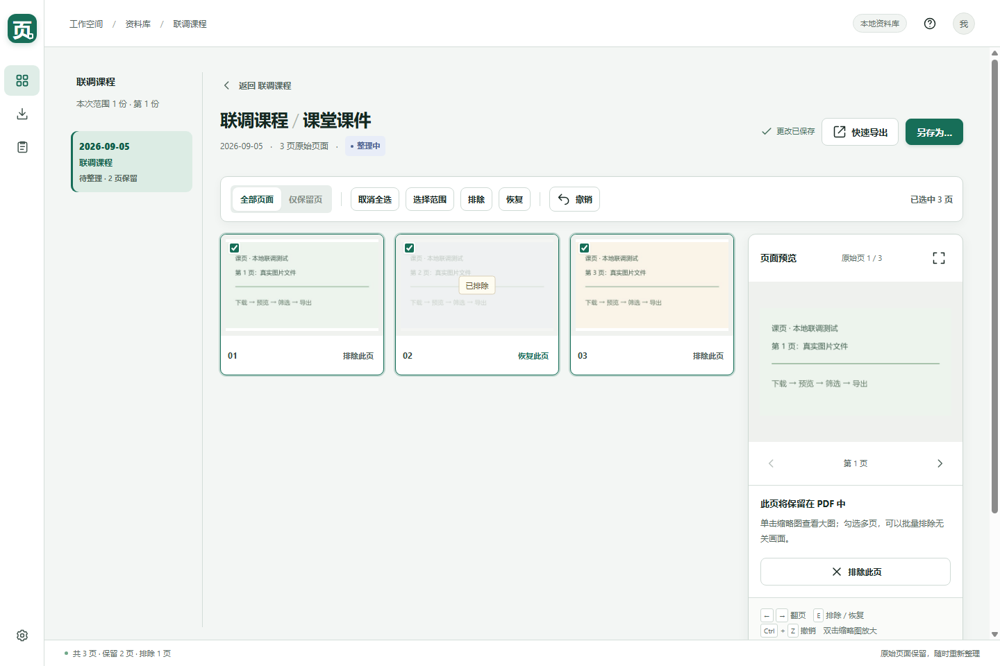
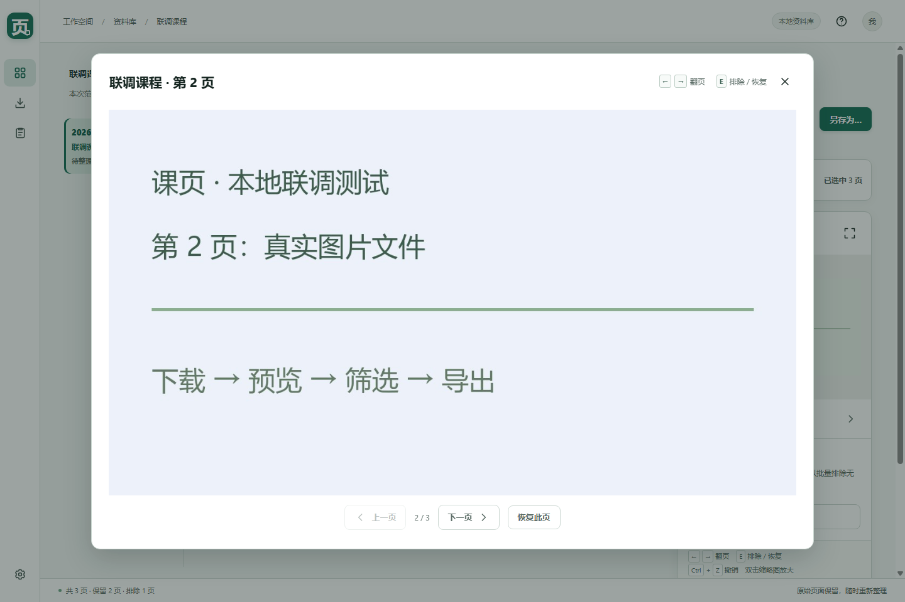

<div align="center">
  
  <h1>课页 · Keye</h1>
  <p>把课堂课件的获取、整理与 PDF 导出，放进一个清楚的工作流。</p>
  <p>
    
    
    
    
  </p>
  <p>
    <a href="https://github.com/goooseby/ScutPPT/releases/latest"><strong>下载最新版</strong></a>
    · <a href="#快速开始">快速开始</a>
    · <a href="#从源码运行">从源码运行</a>
  </p>
</div>



> 课页面向华南理工大学课堂课件平台。账号凭据只在本次运行中使用，不写入课件数据库，也不会传给界面脚本。

## 为什么做课页

课堂平台自动采集的课件常常包含等待画面、重复页和无关内容。课页把原本分散的步骤连成一条简单流程：

```text
登录平台  →  自动扫描课程  →  获取课件  →  排除无效页面  →  导出 PDF
```

整理不是导出的前置条件。你可以直接快速导出，也可以先逐页预览、排除无效页，再生成更干净的 PDF。

## 主要功能

| 功能 | 说明 |
| --- | --- |
| 按课程管理 | 自动按课程和课次归档，集中查看整理与导出状态 |
| 页面筛选 | 缩略图浏览、全屏预览、Shift 连选、批量排除与撤销 |
| 灵活导出 | 单份快速导出、批量分别导出、合并为带书签的 PDF |
| 自动流程 | 登录成功后自动识别状态，日期改变后自动扫描课表 |
| 本地资料库 | 原始文件、筛选记录、课程备注和设置都保存在本机 |
| 后台任务 | 获取、预览和导出在后台执行，失败任务可以重试 |

## 界面预览

<table>
  <tr>
    <td width="50%" align="center">
      <br>
      <strong>按课程扫描与获取</strong>
    </td>
    <td width="50%" align="center">
      <br>
      <strong>本地课程资料库</strong>
    </td>
  </tr>
  <tr>
    <td width="50%" align="center">
      <br>
      <strong>逐页筛选与整理</strong>
    </td>
    <td width="50%" align="center">
      <br>
      <strong>全屏预览与快捷操作</strong>
    </td>
  </tr>
</table>

截图使用演示资料，不包含学校账号或个人课程数据。

## 快速开始

1. 在 [Releases](https://github.com/goooseby/ScutPPT/releases/latest) 下载 `Keye-Windows-x64.zip`。
2. 完整解压压缩包，双击 `Keye.exe`。程序目录内的其他文件需要保留。
3. 打开“获取课件”，在学校网页中完成登录。课页会自动识别登录状态并扫描当前日期范围。
4. 选择课程并获取课件，然后直接导出，或进入资料库筛选页面后再导出。

第一次导出时，课页才会询问默认 PDF 保存目录，并在以后继续使用。取消选择不会创建导出任务；需要更改时，可在“设置”中重新选择。

当前 Windows 包未购买代码签名证书。若系统显示“未知发布者”，请确认下载来源是本仓库的 Release 页面。

## 页面整理快捷键

| 操作 | 快捷键 |
| --- | --- |
| 上一页 / 下一页 | `←` / `→` |
| 排除或恢复当前页 | `E` |
| 撤销 | `Ctrl + Z` |
| 连续选择一段页面 | 先勾选一页，再按住 `Shift` 勾选另一页 |

排除页面不会删除原图。筛选结果会立即保存，关闭应用后再次打开仍然保留。

## 数据与隐私

- 资料库默认位于程序配置指定的本地目录，包含 SQLite 数据库、原始课件、预览图和缩略图。
- 导入文件时复制源文件，不移动原文件；PDF 导出保留所选原始 PDF 页面。
- 登录凭据仅在当前进程内使用，不写入资料库。
- 资料库使用相对路径，可在退出应用后整体备份或复制。
- 回收站只更改资料库记录，不会删除已经导出的 PDF。

## 从源码运行

建议使用 Python 3.13：

```powershell
python -m venv .venv
.\.venv\Scripts\python.exe -m pip install -r requirements.txt
.\.venv\Scripts\python.exe app.py
```

也可以双击项目中的 `启动课页.cmd`。主要依赖包括 PySide6、requests、Pillow、pypdf 和 pypdfium2。

## 构建 Windows 版本

```powershell
.\build.ps1
```

构建结果：

```text
release/
├─ 课页/
│  ├─ Keye.exe
│  └─ ...运行依赖
└─ 课页-Windows-x64.zip
```

这是目录版应用，分享时请使用完整 ZIP，不要只复制 `Keye.exe`。

## 验证

```powershell
.\.venv\Scripts\python.exe -m unittest discover -s tests -v
.\.venv\Scripts\python.exe tests/verify_desktop.py
```

自动验证覆盖课程分组、页面筛选、PDF 导入与导出、任务重试、登录态交接、连续整理和资料库恢复。学校账号登录与真实课程获取仍需在应用中完成端到端验证。

<details>
<summary><strong>项目结构</strong></summary>

```text
app.py                 桌面应用入口
web/                   应用界面
core/desktop.py        界面通信、登录交接与后台任务
core/library.py        本地资料库、页面筛选与 PDF 导出
core/downloader.py     课表、课件获取与重试
auth/browser_login.py  学校网页登录窗口
tests/                 自动化验证
```

</details>

## 当前范围

课页目前专注于 Windows 和华南理工大学课堂课件平台。自动去重识别、裁剪、页面重排、回收站永久清理和资料库自动迁移尚未实现。

遇到问题时，可以在 [Issues](https://github.com/goooseby/ScutPPT/issues) 中说明复现步骤、系统版本和错误表现。请先遮挡学号、姓名、课程名单和登录链接中的敏感参数。

<div align="center">
  <sub>让课件从“下载下来”变成“整理好、随时可用”。</sub>
</div>
